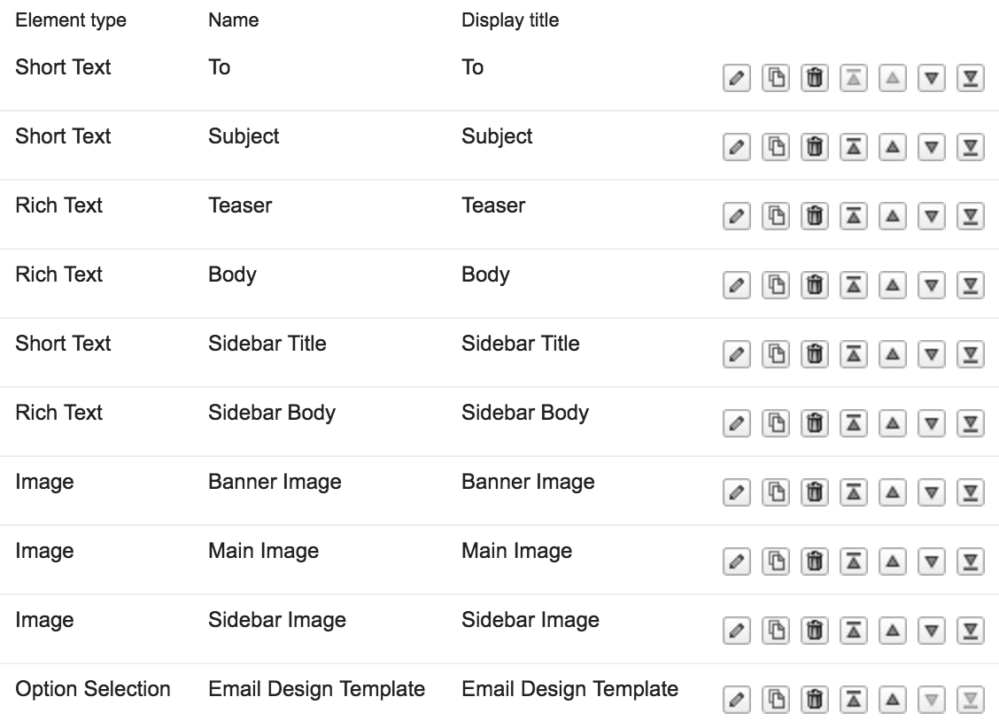

# coles-email-demo

A simple demo that uses a Custom Authoring Action to send an email straight from the IBM WCM Authoring UI.

This demo was designed to work with the "AT - Coles Email" authoring template, which contains the following elements:

  

Features:
  * Adds a "Send as Email" button to the Authoring Form 
  * Iterates through all image elements, and include them as attachments to a MIME multipart message

Output:
  

To customise:
  * In ColesEmailDemo/src/com/ibm/demo/wcm/CustomEmailAuthoringAction.java, you can:
    * Modify the BASE_URL to reflect your hostname
    * Modify the list of elements that contains images to match your Authoring Template
    * Modify the isValidForForm() method to change the Authoring Template on which the "Send as Email" button appears
